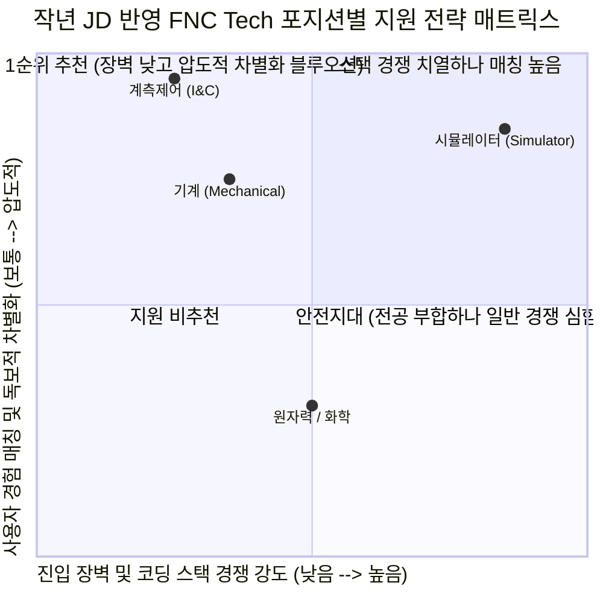

# (주)미래와도전 (FNC Tech) 직무 분석 및 합격 가능성 추천 보고서
**대상 기업**: (주)미래와도전 (FNC Technology)
**분석 대상 직무**: 계측제어(I&C) vs 기계 vs 시뮬레이터 (작년 JD 분석 반영)
**작성일**: 2026-07-27 (작년 상세 JD 반영 및 최종 포지션 확정)

---

## 💡 최종 결론: [계측제어(I&C)]가 압도적 1순위 확정!

작년 상세 채용공고(JD)를 입수하여 면밀히 분석한 결과, 기존의 우려가 명쾌하게 정리되었으며 **합격 확률 및 전략적 우위가 가장 높은 포지션은 [계측제어(I&C)]**로 최종 확정되었습니다.

---

## 1. 작년 JD 기반 포지션별 정밀 해부 및 순위 변경 이유

### 🥇 [추천 1순위 확정] 계측제어 (I&C)
*   **작년 JD 담당업무**: 원자력 계측분야 R&D 및 엔지니어링
*   **작년 JD 자격/우대**: 관련학과 학사 이상, 공학관련 국가공인 자격증 소지자 *(※ 특정 코딩 스택을 전혀 요구하지 않음!)*
*   **💡 1순위 확정 결정적 이유**:
    1.  **코딩 장벽 제로 & 순수 공학 융합 도메인**: IT/시뮬레이터 부문과 달리 프로그래밍 언어 스택 요건이 없습니다. 순수하게 유체·기계 장치에서 발생하는 파라미터를 측정(계측)하고 제어하는 공학적 역량을 평가합니다.
    2.  **경쟁자 방어율 100%의 실무 무기**: 일반 기계 전공자는 제어 시퀀스나 전기 계통을 두려워하고, 전자 전공자는 배관이나 펌프 등 열수력 하드웨어를 모릅니다. 사용자님은 **"쿨링 펌프 과전류 트립 시 인버터 매뉴얼과 시퀀스 제어반 도면을 파고들어 배전함 절연 파괴를 찾아낸 트러블슈팅 경험"**이 있으므로, 심사위원이 찾는 완벽한 '기계-전기 융합 계측제어 엔지니어'입니다.

### 🥈 [추천 2순위 플랜 B] 기계 (Mechanical)
*   **작년 JD 담당업무**: 기계설계 및 구조해석 R&D 및 엔지니어링
*   **작년 JD 자격/우대**: 관련학과 학사 이상, 공학관련 국가공인 자격증 소지자
*   **💡 2순위 추천 이유**: 냉동 플랜트 배관 응력/압력 트러블슈팅 경험과 전동 킥보드 방열 CFD 해석(55% 개선) 경험이 정확히 일치하는 정통 전공 부서입니다. 다만 전국의 기계과 지원자들이 몰려 스펙 경쟁이 가장 치열할 수 있어 2순위로 배치합니다.

### 🥉 [추천 3순위 조정] 시뮬레이터 (Simulator)
*   **작년 JD 담당업무**: 시뮬레이터 모델 개발 및 유지보수, 계측제어 응용설비설계 및 개발
*   **작년 JD 자격/우대**: **기술 스택 (C#, Java, SQL, C++, JavaScript, HTML5, CSS, Spring, Python)** 명시!
*   **💡 순위 조정 이유**: 작년 JD 분석 결과, IT 개발 부문과 함께 묶여 **구체적인 프로그래밍 언어(C#, Java, C++ 등) 기술 스택을 명시적으로 요구**하고 있음을 확인했습니다. 사용자님의 IGCC 5분 예측 대시보드 기획력은 훌륭하지만, 전문 소프트웨어/전산 전공자들과 코딩 문법 및 개발 스택으로 직접 경쟁하는 구도는 전략적 불리함(Risk)이 있습니다. 따라서 코딩 스택 요건이 없는 **[계측제어]**로 승부하는 것이 훨씬 영리하고 확실한 전략입니다.

---

## 2. [계측제어(I&C)] 지원용 4대 무기 매핑 전략

계측제어 포지션에 지원할 때 우리의 기존 무기들을 아래와 같이 맞춤형으로 변환하여 배치합니다.

| 보유 경험 (에셋) | 계측제어(I&C) 맞춤형 매핑 로직 | 심사위원 타격 포인트 |
| :--- | :--- | :--- |
| **쿨링 펌프 과전류 트립 해결** *(인버터 및 시퀀스 도면 분석)* | **[계측제어 하드웨어/전기 트러블슈팅]** 기계 장치의 문제를 타 부서로 넘기지 않고, 직접 인버터 제어반과 시퀀스 도면을 독학해 전기 절연 파괴 원인을 찾아낸 집요함 | "이 지원자는 설비 하드웨어와 제어 로직 간의 간섭 문제를 현장에서 직접 해결해 본 진짜 엔지니어다." |
| **냉동 플랜트 시운전** *(압축기 습압축 & 제상 불량 해결)* | **[플랜트 계측 파라미터 감각]** 압력, 유량, 온도 등 플랜트 핵심 파라미터의 이상 거동을 현장에서 측정(계측)하고 밸브/파라미터를 튜닝해 정상 모델을 도출한 감각 | "원전 계측 설비가 현장 배관에서 어떻게 작동하고 오차를 일으키는지 생생하게 아는 인재다." |
| **IGCC 발전소 5분 예측 대시보드** *(제조 AI 교육 우수상)* | **[계측 데이터 분석 및 모니터링]** 단순 코딩이 아닌, 센서로부터 수집된 공정 파라미터 간 물리·화학적 상관관계를 분석하고 이상 상태를 사전 감시하는 시스템 기획력 | "계측된 데이터를 바탕으로 원전 운전 자문 및 상태 진단 솔루션을 개발할 수 있는 역량까지 갖췄다." |
| **OPIc IH** *(공인영어 우수 성적)* | **[글로벌 원전 프로젝트 대응력]** UAE 원전 등 미래와도전의 해외 엔지니어링 프로젝트에서 기술 문서 해석 및 해외 사업자와의 기술 소통을 주도 | 토익 800점 이상의 자격 요건을 가볍게 뛰어넘는 실무 원어민 회화 역량 입증 |

---

## 3. 최종 요약 및 실행 안내

*   **최종 조언**: 작년 JD를 확인함으로써 우려했던 부분(시뮬레이터 코딩 스택 요구)을 사전에 피하고, **가장 승산이 높은 금맥인 [계측제어(I&C)]**를 찾아냈습니다!
*   **다음 액션**: 이제 망설임 없이 **[계측제어(I&C)]** 포지션으로 타겟을 고정하시고, 이번 2026년 채용 공고에 명시된 **자기소개서 문항 및 글자 수 제한**을 공유해 주세요! 즉시 합격 초안 작성에 돌입하겠습니다.
