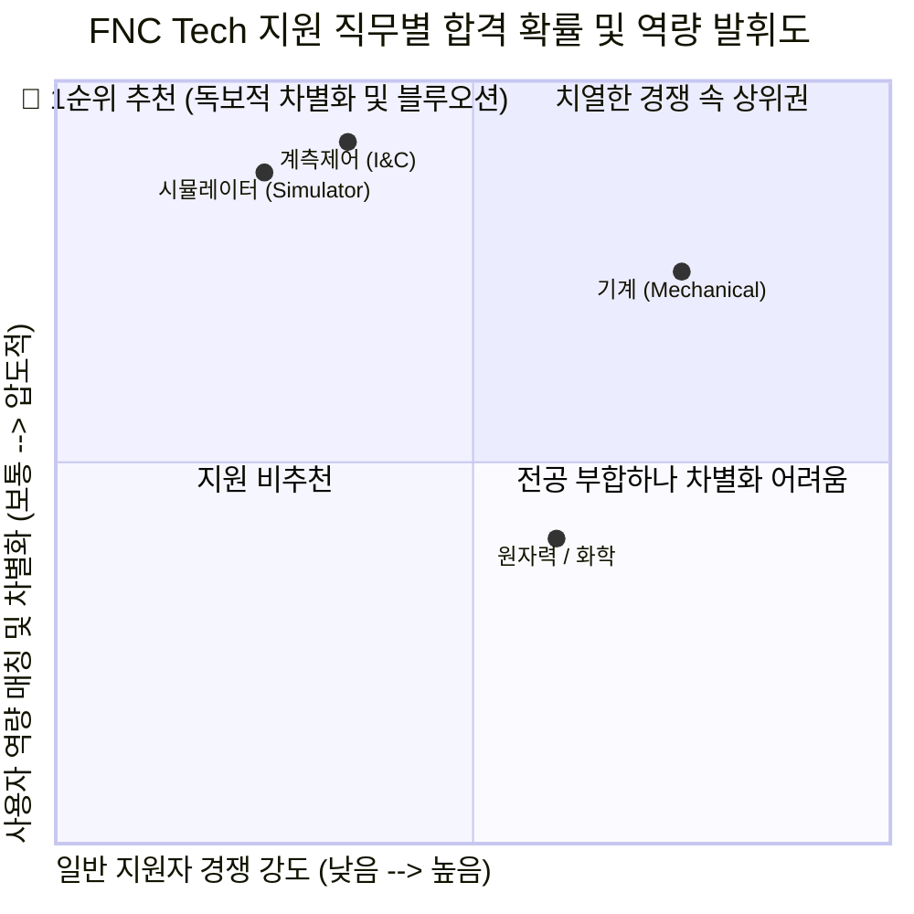

# (주)미래와도전 (FNC Tech) 직무 분석 및 합격 가능성 추천 보고서
**대상 기업**: (주)미래와도전 (FNC Technology)
**분석 대상 직무**: 기계 vs 계측제어(I&C) vs 시뮬레이터
**작성일**: 2026-07-27

---

## 💡 최종 결론 및 추천 포지션

**(주)미래와도전(FNC Tech)**은 원자력 발전소 안전해석, 열수력 해석, 확률론적 안전성 평가(PSA), 그리고 **원전 운전 시뮬레이터 및 계측제어(I&C) 개발** 분야에서 대한민국 최고 수준의 기술력을 가진 원자력 엔지니어링 R&D 전문 기업입니다.

사용자님의 학부 전공(기계), 현장 시운전 경험(플랜트 하드웨어/전기 제어 트러블슈팅), 그리고 교육 프로젝트(IGCC 발전소 데이터 대시보드 및 CFD 모델링) 역량을 종합적으로 분석했을 때, **합격 확률이 가장 높은 추천 1순위 포지션은 [계측제어(I&C)] 또는 [시뮬레이터] 분야**입니다. 

---

## 1. 왜 [계측제어 / 시뮬레이터]가 1순위인가? (독보적 경쟁력 분석)

원자력 발전소의 **계측제어(I&C) 및 시뮬레이터** 분야는 단순한 코딩이나 회로 지식만으로는 업무를 수행할 수 없습니다. 발전소의 **기계적·물리적 현상(유체 유량, 압력, 온도, 펌프/압축기 거동)**을 완벽히 이해하는 동시에, 이를 **제어 로직(시퀀스 도면, 인버터)과 데이터 모델(대시보드, 시뮬레이션)**로 구현할 수 있는 **'융합형 인재'**를 극도로 갈구합니다.

| 사용자님의 보유 무기 (Core Assets) | FNC Tech [계측제어 / 시뮬레이터] 매칭 포인트 | 차별화 파급력 |
| :--- | :--- | :--- |
| **① IGCC 발전소 5분 예측 대시보드 구축** *(제조 AI 교육 프로젝트)* | **[시뮬레이터 모델 개발 / 계측제어 응용설비]** 발전소 공정 파라미터 간 물리·화학적 상관관계를 분석하고, 실무자가 조작하여 미래 상태를 예측하는 대시보드는 **원전 운전 시뮬레이터 및 감시 시스템 개발과 100% 일치**하는 실무 역량입니다. | **★ ★ ★ ★ ★ (압도적)** 순수 기계공학 지원자 중 발전소 데이터 예측 UI/UX 모듈을 직접 만들어본 인재는 거의 제로에 가깝습니다. |
| **② 쿨링 펌프 과전류 트립 해결** *(전기 제어반 인버터/시퀀스 도면 분석)* | **[발전소 계측제어설비 설계 및 현장 대응]** 기계 하드웨어의 문제를 타 부서에 넘기지 않고, 직접 인버터 매뉴얼과 시퀀스 제어 도면을 파고들어 전기 누수(절연 파괴)를 해결해 낸 역량입니다. | **★ ★ ★ ★ ★ (압도적)** 기계 설비와 전기·제어 로직 간의 간섭과 트러블을 현장에서 해결해 본 최고의 트러블슈팅 자산입니다. |
| **③ 냉동 플랜트 시운전 및 최적화** *(압축기 습압축 & 증발기 제상 불량)* | **[발전소 계측제어 R&D / 열수력 거동 이해]** 배관 응력, 압력 저하, 유량 등 발전소의 핵심 파라미터를 현장에서 측정하고 튜닝하여 최적 시운전 모델을 도출해 본 살아있는 감각입니다. | **★ ★ ★ ★ ☆ (매우 높음)** 시뮬레이터 개발 시 가상 모델과 실제 플랜트 현장 물리량 간의 오차를 보정(튜닝)할 수 있는 실력입니다. |
| **④ 전동 킥보드 방열 성능 55% 개선** *(CFD 유동 해석 및 모델링)* | **[시뮬레이터 모델 개발 / R&D]** 복잡한 유체 유동 문제를 단계별 공학적 프로세스로 구조화하여 해석 툴(CFD)로 모델링하고 설계를 개선한 기본기입니다. | **★ ★ ★ ★ ☆ (매우 높음)** FNC Tech의 핵심 기술인 열수력 안전 해석 및 시뮬레이션 모델링 R&D의 튼튼한 기초가 됩니다. |
| **⑤ OPIc IH (글로벌 소통 역량)** | **[자격요건 완벽 충족 및 글로벌 사업 참여]** FNC Tech는 UAE 원전 사업 등 해외 프로젝트 참여가 많습니다. 어학 우수자로서 해외 기술 문서 해석 및 미팅에 유리합니다. | **★ ★ ★ ☆ ☆ (필수 충족)** 토익 800점 이상 또는 OPIc IM2 이상의 지원 자격요건을 넉넉하게 넘어서는 IH 등급 보유. |

---

## 2. 포지션별 상세 비교 및 추천 전략

### 🥇 [추천 1순위] 계측제어 (I&C) 또는 시뮬레이터 (Simulator)
*   **주요 담당업무**: 발전소 계측제어설비 설계, 시뮬레이터 모델 개발 및 유지보수, 계측제어 응용설비 개발.
*   **합격 전략**: "기계공학적 도메인(유체/열수력/설비 거동)을 완벽히 이해하며, 이를 전기 제어 도면 분석과 AI 데이터 대시보드(시뮬레이션 모듈)로 구현할 수 있는 **유일무이한 발전소 융합 엔지니어**"로 포지셔닝합니다.
*   **추천 이유**: 일반적인 CS/전기 전공자는 플랜트의 기계적 열수력 현상을 모르고, 기계 전공자는 제어 시퀀스와 대시보드 모델링을 모릅니다. 사용자님은 이 두 가지를 모두 경험한 최고의 인재상입니다.

### 🥈 [추천 2순위] 기계 (Mechanical)
*   **주요 담당업무**: 기계분야 R&D 및 엔지니어링, 발전소 기계설계 및 구조해석(열수력, 배관 응력 등).
*   **합격 전략**: 냉동 플랜트 시운전 경험(배관 응력, 압력 저하 해결)과 CFD 브레이크 방열 해석 경험을 앞세워 원전 기계 설비 및 배관/구조 해석에 최적화된 엔지니어임을 강조합니다.
*   **추천 이유**: 전공과 가장 직접적으로 부합하나, 전국 기계과 전공자들의 지원이 집중되어 경쟁률이 가장 높을 수 있습니다. 따라서 2순위 플랜 B로 둡니다.

---

## 3. FNC Tech 맞춤형 자소서 컨셉 및 스토리라인 제안

FNC Tech에 지원할 때는 우리에게 이미 완성되어 있는 **4대 핵심 합격 공식(직업인 시퀀스 + 3대 무기 에피소드 + 데드라인 방어 장단점)**을 아래와 같이 맞춤형으로 매핑하여 투입하면 됩니다.

1. **지원동기 (직업인 시퀀스 적용)**
   - **경쟁력**: 국내 원전 안전성 평가(PSA), 열수력 해석, 운전 시뮬레이터 분야에서 한수원(KHNP) 등의 핵심 파트너로 인정받는 독보적 기술력.
   - **기민함**: 기존 안전 해석을 넘어 격납건물 여과배기 설비(CFVS) 국산화, 4차 산업혁명 기반 디지털 혁신(Digital Innovation) 및 AI 예측 플랫폼으로 확장하는 기민함.
   - **기여가능성**: 기계 설비 현장 트러블슈팅 감각과 IGCC 대시보드(시뮬레이션 모듈) 구축 역량을 결합하여 발전소 계측제어/시뮬레이터 R&D에 즉각 기여.

2. **직무 역량 / 성취 경험 (무기 ①, ② 활용)**
   - **IGCC 대시보드 경험**을 통해 공정 파라미터 간 상관관계를 분석하고 사용자 맞춤형 감시·예측 시스템을 구현하는 '소프트웨어/데이터 모델링 역량' 입증.
   - **펌프 트립 해결(인버터/시퀀스 도면)** 경험을 통해 기계 설비와 전기 제어 로직을 통합적으로 파악하는 '하드웨어/제어 트러블슈팅 역량' 입증.

3. **성격의 장단점 및 가치관 (100% 방어 패턴 적용)**
   - **장점**: 대시보드 개발 당시 감정적 갈등을 '공동의 목표 상기'로 해결한 소통의 리더십.
   - **단점**: 다양한 변수 고려로 인한 결단 지연 $\rightarrow$ 선제적 도메인 학습 및 스스로 마감기한(데드라인)을 설정하는 구조화로 극복.

---

## 4. 다음 단계 (Action Items)

1.  **지원 포지션 최종 선택**: 추천해 드린 **[계측제어]** 또는 **[시뮬레이터]** (혹은 [기계]) 중 지원하실 정확한 부문을 결정해 주세요. (개인적으로는 **계측제어** 또는 **시뮬레이터**를 강력히 추천합니다!)
2.  **자소서 문항 공유**: 사람인 입사지원 페이지 또는 공고에 명시된 **FNC Tech의 자기소개서 문항과 글자 수 제한**을 복사해서 공유해 주시면, 바로 이 강력한 융합 전략을 담아 압도적인 합격 초안 작성을 시작하겠습니다!
