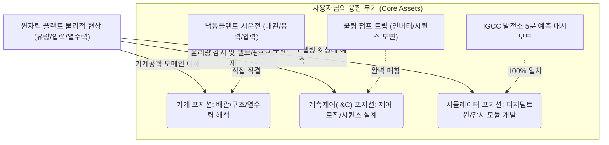

# (주)미래와도전 (FNC Tech) 직무 분석 및 합격 가능성 추천 보고서
**대상 기업**: (주)미래와도전 (FNC Technology)
**분석 대상 직무**: 기계 vs 계측제어(I&C) vs 시뮬레이터
**작성일**: 2026-07-27 (기업 서비스 본질 및 직무 걱정 팩트체크 개편)

---

## 💡 최종 결론 및 추천 포지션

**(주)미래와도전(FNC Tech)**은 원자력 발전소 안전해석, 열수력 해석, 확률론적 안전성 평가(PSA), 그리고 **원전 운전 시뮬레이터 및 계측제어(I&C) 개발** 분야에서 대한민국 최고 수준의 기술력을 가진 원자력 엔지니어링 R&D 전문 기업입니다.

사용자님의 학부 전공(기계), 현장 시운전 경험(플랜트 하드웨어/전기 제어 트러블슈팅), 그리고 교육 프로젝트(IGCC 발전소 데이터 대시보드 및 CFD 모델링) 역량을 종합적으로 분석했을 때, **합격 확률이 가장 높은 추천 1순위 포지션은 [계측제어(I&C)] 또는 [시뮬레이터] 분야**입니다.

---

## 1. 미래와도전(FNC Tech)은 도대체 무엇을 제공하는 회사인가? (비즈니스 본질)

쇳덩어리 기계 부품이나 밸브를 직접 깎아서 파는 제조사가 아닙니다. 원자력 발전소 및 대형 플랜트의 **'안전성 평가(Safety Assessment)', '사고 해석 및 진단', '디지털트윈/시뮬레이션 소프트웨어'**를 제공하는 대한민국 1위 **[원자력 엔지니어링 씽크탱크 & 솔루션 기업]**입니다.

*   **핵심 고객(B2B/B2G)**: 한국수력원자력(KHNP), 한국원자력연구원(KAERI), 한국전력기술(KEPCO E&C), 해외 원전 사업자(UAE 바라카 원전 등).
*   **왜 이 회사가 중요한가? (기사 & 브로슈어 분석)**: 최근 SMR(소형모듈원자로) 개발 및 AI 데이터센터 전력 공급용 원전이 급부상하고, 기존 원전의 수명 연장(주기적 안전성 평가 PSR) 수요가 폭발하고 있습니다. 이때 원전 사업자들은 **"이 발전소가 지진, 냉각수 파단(LOCA), 정전 등 극한의 사고에서도 절대적으로 안전한가?"**를 국가 규제기관에 입증해야 합니다. FNC Tech는 이를 고도의 공학적 계산, 유동 해석 코드, 디지털트윈 시뮬레이터로 시뮬레이션하고 검증해 주는 핵심 서비스를 제공합니다.

---

## 2. 3대 포지션(기계 vs 계측제어 vs 시뮬레이터) 실제 업무 및 걱정 파타(Fact Check)

사용자님께서 우려하신 **"계측제어는 전자/제어과 우대? 시뮬레이터는 컴공 석박사나 전문 개발자만?"**에 대한 공학적 팩트 체크와 실제 담당 업무 해부입니다.

### ① 계측제어 (I&C - Instrumentation & Control)
*   **실제 하는 일**: 원전이 정상 가동되거나 사고가 났을 때, 유량/압력/온도를 계측(Sensor)하여 펌프를 멈추거나 밸브를 개폐하는 **감시·제어설비의 제어 로직(Sequence) 설계 및 시스템 엔지니어링**.
*   **🚨 사용자님의 걱정**: "전자공학이나 제어공학 전공자를 더 우대하지 않을까?"
*   **💡 팩트 체크 (Why You Win)**: **절대 그렇지 않습니다! 오히려 기계공학 배경이 극도로 유리합니다.**
    *   원전 계측제어의 제어 대상은 100% **"펌프, 밸브, 열교환기, 압축기 등 유체 기계 설비"**입니다. 순수 전자/회로 전공자는 기계 장치가 압력이 찼을 때 왜 캐비테이션이 생기거나 과부하 트립이 나는지 물리적 거동을 전혀 모릅니다.
    *   특히 사용자님의 **"쿨링 펌프 과전류 트립 당시, 기계 점검에 그치지 않고 인버터 매뉴얼과 시퀀스 제어 도면을 파고들어 배전함 누수(절연 파괴)를 잡아낸 경험"**은 기계와 전기/제어가 만나는 실무 현장의 끝판왕 에피소드입니다! 기계 설비의 거동을 알면서 시퀀스 도면을 볼 줄 아는 인재는 계측제어 팀의 0순위 타겟입니다.

### ② 시뮬레이터 (Simulator)
*   **실제 하는 일**: 원전 운전원들이 훈련하는 가상 시뮬레이터나, 공정 이상 상태를 실시간으로 감시·예측하는 **디지털트윈 소프트웨어 모듈 및 응용 프로그램 개발/유지보수**.
*   **🚨 사용자님의 걱정**: "개발자나 석·박사급 시뮬레이션 툴 경험자만 뽑지 않을까?"
*   **💡 팩트 체크 (Why You Win)**: **컴공 개발자만 일하는 곳이 아닙니다! 시뮬레이터 팀의 핵심은 '공정 모델러(Process Modeler)'입니다.**
    *   전문 코더(컴공)들은 C++, Java 문법은 잘 알지만, **"밸브를 30% 잠갔을 때 압력과 엔탈피가 어떻게 변하는지"** 열역학/유체역학 방정식과 공정 알고리즘을 모릅니다.
    *   사용자님께서 제조 AI 교육 프로젝트에서 직접 구축했던 **"IGCC 발전소 공정 파라미터 상관관계 분석 및 5분 후 상태 예측 대시보드"**가 정확히 **[미니 원전 시뮬레이터(디지털트윈 감시 모듈)]**입니다!
    *   "나는 단순 코더가 아니라, 공정 물리량의 인과관계를 이해하고 시뮬레이션 알고리즘을 설계해 실무자용 대시보드 UI로 시각화해 본 공정 시뮬레이션 엔지니어다"라고 설득하면 석·박사 부럽지 않은 강력한 차별화가 됩니다.

### ③ 기계 (Mechanical)
*   **실제 하는 일**: 발전소 배관, 기기, 구조물의 응력 해석, 건전성 평가 및 열수력 해석 R&D.
*   **💡 매칭 포인트**: 냉동 플랜트 시운전 당시 배관 응력, 압력 저하 해결 경험과 학부 시절 전동 킥보드 방열 CFD 해석(55% 개선) 경험이 그대로 쓰이는 정통 기계 엔지니어링 부서입니다. (경쟁률은 가장 높을 수 있습니다.)

---

## 3. 포지션별 경쟁력 요약표

| 포지션 | 일반 지원자들의 한계 | 사용자님만의 독보적 무기 (차별화 포인트) | 합격 확률 |
| :--- | :--- | :--- | :--- |
| **계측제어 (I&C)** | • 전자과: 기계 설비 물리적 거동 모름 • 기계과: 제어 로직 및 시퀀스 도면 모름 | **[기계 + 전기/시퀀스 융합]** 펌프 과전류 트립 시 시퀀스 도면과 인버터를 직접 분석하여 절연 파괴 결함을 해결해 본 실전 감각 | **★ ★ ★ ★ ★ (추천 1순위)** |
| **시뮬레이터 (Simulator)** | • 컴공과: 열역학/유체공정 물리 방정식 모름 • 기계과: 데이터 핸들링 및 UI/UX 시각화 모름 | **[기계 유체 + 발전소 예측 대시보드]** IGCC 발전소 공정 파라미터를 분석해 5분 후 상태 예측 대시보드를 직접 제작해 본 디지털트윈 역량 | **★ ★ ★ ★ ★ (추천 1순위)** |
| **기계 (Mechanical)** | • 전국의 기계과 지원자 집중으로 스펙 및 학점 인플레이션 심함 | **[현장 시운전 + CFD 해석 기본기]** 냉동 플랜트 배관/압력 트러블슈팅 및 브레이크 방열 55% 개선 유동 해석 기본기 | **★ ★ ★ ★ ☆ (추천 2순위)** |

---

## 4. 최종 전략 조언 (How to Win)

사용자님이 걱정하시는 부분은 **"남들이 모르는 융합 영역"**이기 때문에 생기는 기분 좋은 착시입니다. 남들도 똑같이 어렵고 접근하기 힘듭니다.

1.  **계측제어(I&C)를 선택하신다면**: "기계 설비 거동을 아는 제어 트러블슈터"로 자소서를 구성합니다. (펌프 트립 + 시운전 경험 중심)
2.  **시뮬레이터를 선택하신다면**: "공정 물리량을 시공간 데이터로 시각화하는 디지털트윈 모델러"로 구성합니다. (IGCC 대시보드 + CFD 해석 경험 중심)
3.  **기계를 선택하신다면**: "현장 배관/유체 감각을 갖춘 열수력 및 구조 해석 엔지니어"로 구성합니다.

지원하실 정확한 포지션을 골라주시고 **자소서 문항**을 내려주시면, 이 팩트들을 바탕으로 심사위원의 고개를 끄덕이게 만들 압도적인 초안을 즉시 뽑아내겠습니다!
