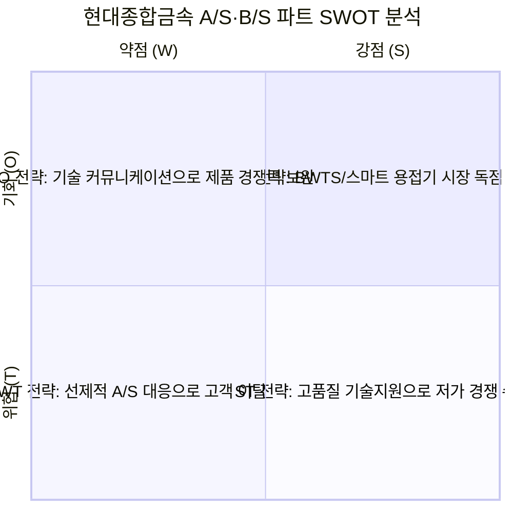

# 현대종합금속 직무 분석 및 합격 가능성 분석 보고서
**대상 직무**: 최고기술경영실 (A/S, B/S 파트) 신입
**작성일**: 2026-07-24 (SWOT 분석 및 전략적 매핑 추가)

---

## 💡 결론 및 최종 평가
**매우 강력한 합격 가능성을 가진 '맞춤형 포지션'입니다.** 
과거 작성하셨던 플랜트 시운전, 하드웨어 트러블슈팅, 고객사 스펙 도출, 글로벌 어학 역량이 이번 현대종합금속의 A/S, B/S 직무 요구사항(JD) 및 기업의 환경적 SWOT 요소와 완벽하게 톱니바퀴처럼 맞물립니다.

---

## 1. 현대종합금속 & A/S, B/S 파트 SWOT 분석

기업의 환경적 상황과 사업적 포지셔닝을 SWOT으로 분석하고, 지원자로서 기여할 수 있는 전략적 결합점(Strategy Matrix)을 도출했습니다.

### 🔷 Strength (강점)
- **국내 대표 용접 종합 솔루션 기업**: 용접재료부터 용접기, 자동화 장비까지 전 부문 아우르는 기술력 보유.
- **HD한국조선해양과의 강력한 파트너십**: 필터 없는 간접 전기분해 방식의 BWTS('HiBallast NF') 공식 제작사로서 시운전·서비스 전담 독점적 지위.
- **제조-시운전-AS 통합 서비스**: 단순 판매를 넘어 현장 대응 및 기술 컨설팅(B/S, A/S)까지 일괄 제공하는 솔루션 구조.

### 🔶 Weakness (약점)
- **조선·중공업 경기 변동성 의존도**: 조선업 시황에 따른 실적 변동성 노출.
- **전통 용접재료의 수익성 한계**: 범용 제품군에서의 마진율 압박으로 고부가가치 장비(BWTS, 스마트 용접기) 비중 확대 필수.

### 🟢 Opportunity (기회)
- **IMO 환경 규제 강화**: 선박평형수 관리법 시행 및 강화로 BWTS 신조/개조 수요 지속 창출.
- **조선·해양 인프라의 친환경·스마트화**: 자동화 용접 장비 및 친환경 해양 기자재 기술 지원 수요 증가.
- **글로벌 선주/조선소 네트워크 확대**: 해외 시장 기술 대응 역량의 중요성 증대.

### 🔴 Threat (위협)
- **중국산 저가 장비/소재의 추격**: 가격 경쟁력을 앞세운 후발 주자들의 시장 침투.
- **원자재 가격 및 환율 변동성**: 원가 상승 및 해외 AS 비용 부담 리스크.

---

## 2. SWOT 기반 지원자 전략적 매핑 (Candidate SWOT-Strategy Match)

| SWOT 전략 구분 | 기업의 대응 과제 | 지원자의 기여 포인트 (자소서 연결) |
| :--- | :--- | :--- |
| **SO 전략** (강점×기회) | **BWTS 및 친환경 장비 시장 점유율 극대화** | **[어학 + 플랜트 시운전 경험]** OPIc IH 기반 글로벌 어학 능력으로 해외 선주/조선소 대상 B/S 기술 협의 및 BWTS 현장 시운전 신속 대응 |
| **ST 전략** (강점×위협) | **저가 제품 추격에 맞선 고품질 A/S 경쟁력 확보** | **[기계+전기 융합 트러블슈팅]** 펌프 트립 당시 전기 제어 파트까지 파고든 집요함으로 장비 결함을 근본 해결하여 고객 신뢰 사수 |
| **WO 전략** (약점×기회) | **고부가가치 기술 솔루션 중심 B/S 체질 개선** | **[역설계 기반 스펙 도출]** 고객사 운전 조건을 공학적으로 역설계(Reverse Engineering)하여 기계/용접기 최적 스펙을 제안하는 프리세일즈 |
| **WT 전략** (약점×위협) | **설비 장애 리스크 최소화 및 선제적 품질 관리** | **[제조 AI & 대시보드 구축 역량]** IGCC 데이터 분석 및 대시보드 경험을 바탕으로 설비 이상 징후 파악 및 선제적 B/S/AS 관리 |

---

## 3. 직무 및 우대사항 팩트 체크 (JD 분석)

현대종합금속 최고기술경영실 A/S, B/S 파트는 장비의 **'기술 영업/협의(Before-Sales)'**와 **'현장 품질관리 및 트러블슈팅(After-Sales)'**을 담당하는 전천후 기술 요원을 뽑는 자리입니다.

| JD (담당업무/우대사항) | 사용자님의 '현재' 보유 역량 (강력한 무기) | 매칭 포인트 |
| :--- | :--- | :--- |
| **품질관리 및 기술지원 (A/S)** | 플랜트 시운전 펌프/압축기 현장 트러블슈팅 | 펌프 트립 당시 **전기 제어(인버터/시퀀스) 파트까지 파고들어 문제를 해결한 경험(E1)**은, 기계와 전기가 복합된 용접기 및 BWTS의 A/S 엔지니어로서 최고의 무기입니다. |
| **용접기기 기술 협의 (B/S)** | 고객사 운전 조건 기반 공학적 역설계(Reverse Engineering) 스펙 도출 경험 | 영업 단계에서 고객의 요구를 수리적/물리적으로 분석하여 최적의 장비 스펙을 제안하는 **'B/S(Before-Sales)' 역량에 완벽히 부합**합니다. |
| **BWTS(선박평형수) 관리** | 냉동 플랜트 시운전 (배관, 유량, 압력, 응력 제어) | 선박평형수 처리장치(BWTS) 역시 거대한 펌프, 밸브, 배관, 전해조로 이루어진 '플랜트'입니다. 유체 및 기계 설비를 다뤄본 경험이 100% 직결됩니다. |
| **영어 능통자 (우대)** | OPIc IH 획득 및 꾸준한 회화 학습 | BWTS는 전 세계 바다를 누비는 선박에 장착되므로 해외 선주 및 조선소와의 기술 미팅(B/S), 해외 A/S 비중이 큽니다. 어학 역량은 엄청난 가산점입니다. |

---

## 4. 자소서 핵심 어필 전략 (How to Win)

이번 현대종합금속 자소서에서는 기존에 활용했던 **'프로페셔널한 현장/데이터 엔지니어'**의 프레임을 A/S(기술지원)와 B/S(기술협의) 두 축으로 나누어 타격해야 합니다.

1. **A/S (After-Sales) 전략: 기계+전기를 아우르는 집요한 트러블슈터**
   - 용접기와 BWTS는 단순한 쇳덩어리가 아니라 고도의 전기 전자 제어가 들어간 장비입니다. 
   - *활용 에피소드*: "펌프 트립 발생 시 기계 점검에 그치지 않고 배전함 누수로 인한 절연 파괴(전기 제어 파트)까지 추적했던 집요함"을 어필하여, 현장 A/S 상황에서 원인을 가리지 않고 문제를 해결하는 해결사임을 강조합니다.

2. **B/S (Before-Sales) 전략: 고객의 니즈를 데이터로 증명하는 기술 컨설턴트**
   - B/S는 제품을 팔기 전에 고객의 환경에 우리 제품이 왜 맞는지 기술적으로 설득하는 과정입니다.
   - *활용 에피소드*: "플랜트 시운전 시 고객사 운전 조건 변경 요구를 역설계하여 스펙을 도출한 경험"과 "IGCC 발전소 공정 파라미터 대시보드 구축 경험"을 엮어, 고객의 요구사항을 감이 아닌 데이터와 공학적 분석으로 입증하는 B/S 역량을 어필합니다.

3. **마인드셋: "안정화의 카타르시스를 아는 직업인"**
   - 압축기와 증발기(습압축, 제상불량) 문제를 파라미터 튜닝으로 해결하며 느꼈던 '문제 해결의 즐거움'을 강조합니다. B2B 장비 A/S의 험난한 현장에서도 스트레스가 아닌 '카타르시스'를 느끼며 끈질기게 매달리는 성향임을 보여줍니다.

---

## 📝 다음 단계 (Next Step)
위 분석 및 SWOT 기반 전략에 보듯, 직무 적합도가 극도로 높습니다. **현대종합금속의 자소서 문항과 글자 수 제한**을 복사해서 붙여넣어 주시면, 위 SWOT 전략을 바탕으로 완벽하게 조준된 자소서 초안을 즉시 작성하겠습니다!
