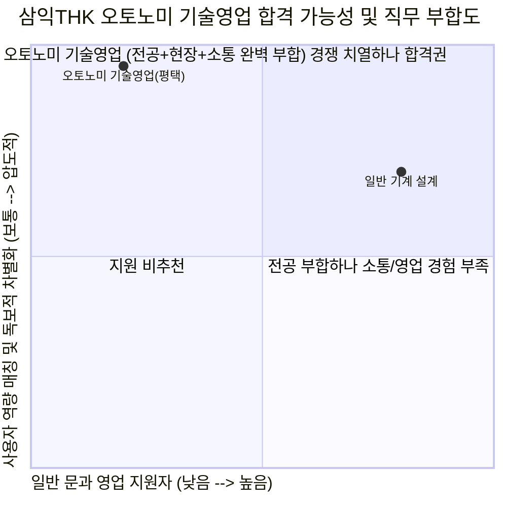

# 삼익THK 직무 분석 및 합격 가능성 추천 보고서
**대상 기업**: 삼익THK (Samick THK)
**분석 대상 직무**: 오토노미 기술영업 (AMR/AGV/AX 솔루션) - 평택 근무
**작성일**: 2026-07-30

---

## 💡 최종 결론 및 평가

**삼익THK**는 반도체/디스플레이 장비의 핵심 부품인 LM가이드와 볼나사 분야의 국내 압도적 1위 기업입니다. 하지만 현재 이들이 가장 목말라하는 것은 '단순 부품 제조사'를 넘어 **'AMR/AGV 자율주행 로봇 및 AI 기반 스마트팩토리 솔루션(AX) 제공 기업'**으로 탈바꿈하는 것입니다.

평택 사업장의 **[오토노미 기술영업]** 포지션은 단순 영업 사원이 아니라, 삼성전자 평택 캠퍼스 등 최첨단 제조 현장에 자율주행 로봇을 반입하고 기술 검증(PoC)을 수행하며 고객을 설득하는 **'현장 기술 사령관'**입니다. 사용자님의 **[기계/전기 융합 트러블슈팅 역량 + 고객 클레임 방어 및 기구 개조 제안 경험 + AI 대시보드 데이터 역량]**은 이 직무가 요구하는 100% 완벽한 맞춤형 치트키입니다.

---

## 1. 기업 분석 및 오토노미 신사업의 본질

### ① 삼익THK '오토노미(Autonomy)' 부서란 무엇인가?
*   **비즈니스 본질**: 기존 하드웨어(LM가이드/액추에이터) 중심에서 벗어나, **AMR(자율이동로봇), AGV(무인운반차), 다관절 로봇** 완제품과 이를 제어하는 **AI 소프트웨어 솔루션(AX)**을 묶어서 B2B로 판매하는 삼익THK의 최우선 미래 먹거리 부서입니다. (최근 FPT와 AI 소프트웨어 협력 MOU 체결 등 공격적 행보)
*   **왜 평택(Pyeongtaek)인가?**: 평택은 삼성전자 세계 최대 반도체 공장(P1~P6) 및 수많은 2차전지/자동차 부품사들이 포진한 핵심 거점입니다. 공장 무인화(Lights-out manufacturing)의 수요가 폭발하는 곳으로, 여기서 AMR 영업을 뚫어내는 것이 삼익THK 로봇 사업의 명운을 쥐고 있습니다.

### ② 삼익THK 오토노미 로봇 사업 SWOT 분석

| 구분 | 내용 | 기술영업 연결 포인트 (How to use) |
| :--- | :--- | :--- |
| **강점 (Strength)** | • 정밀 기계 부품(LM가이드 등) 원천 기술력 • 로봇 구동부 메커니즘에 대한 압도적 이해도 | "경쟁사 로봇과 달리, 삼익THK의 AMR은 관절과 구동부의 정밀도 및 하드웨어 내구성이 근본적으로 다르다"고 고객을 설득하는 무기. |
| **약점 (Weakness)** | • AI 알고리즘 및 소프트웨어 후발 주자 • 시장 내 '부품사'라는 고정관념 강함 | 고객사에 단순 로봇이 아닌 **'데이터 기반 지능형 솔루션'**임을 어필해야 함. (사용자님의 IGCC AI 대시보드 역량 투입!) |
| **기회 (Opportunity)** | • 반도체/2차전지 라인 무인화 및 물류 자동화 수요 폭발 • 위험 공정 로봇 대체 가속화 | 고중량물 이송이나 극한 환경(냉동 플랜트 등)에서의 현장 제어 감각을 살려 PoC(기술 검증) 성공률 극대화. |
| **위협 (Threat)** | • 중국산 저가 AGV 공세 • 국내 대기업(두산, 한화)의 모바일 로봇 진출 | 중국산이 따라올 수 없는 '즉각적인 현장 트러블슈팅 및 기구부 맞춤형 개조(Customizing) 대응력'으로 방어. |

---

## 2. JD 분석 및 사용자 역량 매칭 (4대 필승 연결고리)

기술영업(Technical Sales)은 단순히 말을 잘하는 직무가 아닙니다. 공고에 명시된 **"PoC(기술검증) 수행"**이란, 로봇을 고객사 공장에 들고 가서 "장애물 회피, 적재 하중 테스트, 배터리 방전 문제" 등을 현장에서 직접 해결하며 성능을 입증하는 극한의 현장직입니다.

| JD 필수/우대 역량 | 사용자님의 보유 무기 (Core Assets) | 직무 매칭 포인트 및 심사위원 타격력 |
| :--- | :--- | :--- |
| **1. PoC(기술검증) 수행 및 현장 대응력** *(기구 및 메커니즘 지식 보유자)* | **[기계+전기 트러블슈팅] 쿨링 펌프 트립 해결** 단순 기계 점검을 넘어 인버터와 시퀀스 도면을 독학해 전기 절연 파괴를 잡아낸 경험. | **[완벽 부합]** 고객사 현장에 투입된 AMR이 원인 모를 멈춤(Trip)을 겪을 때, 기계적 간섭인지 제어반 통신 에러인지 즉각 진단하고 현장에서 수리(PoC 성공)해 낼 수 있는 진짜 엔지니어 영업사원. |
| **2. 고객사 관리 및 불만 해소** *(신규 고객 발굴 및 네트워크 구축)* | **[클레임 방어 및 기구 개조 제안]** 시운전 후 고객 클레임 시 데이터를 통해 책임 소재를 명확히 하고, 오히려 고객 요구에 맞춘 **설비 기구 수정을 선제 제안·실행**해 낸 경험. | **[압도적 무기]** "로봇 영업 중 고객이 성능 불만을 제기해도 핑계 대지 않고, 고객 라인에 맞춘 기구부(지그/그리퍼) 개조를 제안해 턴키로 수주를 따낼 수 있는 협상가." |
| **3. AX (AI 솔루션) 기술영업** *(로봇 및 자동화 설비 지식)* | **[AI 데이터 시각화] IGCC 발전소 대시보드** 제조 현장의 공정 데이터를 분석하고 5분 예측 대시보드로 시각화하여 제조 AI 우수상을 받은 역량. | **[차별화 포인트]** 하드웨어(AMR)뿐만 아니라, 삼익THK가 추진하는 AI 관제 솔루션(AX)의 데이터 흐름을 이해하고 고객에게 '지능화의 가치'를 세일즈할 수 있는 인재. |
| **4. 글로벌 시장 개척** *(외국어 가능자 및 문서 작성)* | **[어학 및 공학 지식] 기계공학 전공 + OPIc IH** | 글로벌 고객(평택 내 외국계 반도체 장비사 등)과의 기술 미팅 및 영문 PoC 리포트 작성이 즉시 가능한 준비된 글로벌 기술영업 인재. |

---

## 3. 자소서 작성 방향성 및 핵심 컨셉 (Action Plan)

사용자님은 일반적인 '문과형 영업' 지원자들과는 차원이 다릅니다. 철저하게 **"현장 하드웨어 제어 능력을 갖춘 최전선 솔루션 프로바이더"**로 포지셔닝해야 합니다.

1.  **지원동기**: "국내 LM가이드 1위의 '정밀 하드웨어 신뢰성'에 기반한 삼익THK의 로봇이라면, 현장에서 고객을 가장 확실히 설득할 수 있다는 확신. 나는 하드웨어 메커니즘을 아는 기술영업인으로서 삼익THK의 AX 오토노미 전환의 최전선 선봉장이 되겠다."
2.  **직무 역량 (PoC 수행력)**: 플랜트 시운전 및 펌프 전기/시퀀스 트러블슈팅 경험을 통해, AMR 기술 검증 시 발생하는 예상치 못한 기계/전기적 변수를 현장에서 즉각 해결하고 PoC를 성공시킬 수 있는 엔지니어링 역량 어필.
3.  **협업/고객관리**: 시운전 클레임 방어 및 기구 개조 제안 경험을 통해, 고객의 불만을 단순한 A/S로 넘기지 않고 고객 라인에 맞춘 커스터마이징(기구 수정) 제안으로 역영업을 창출하는 적극적 고객관리 역량 어필.

---

### 📝 다음 단계

삼익THK 오토노미 기술영업 포지션은 사용자님의 현장 트러블슈팅 및 고객 설득 경험이 200% 빛을 발하는 자리입니다. 

사람인 또는 자사 채용 홈페이지에 나와 있는 **삼익THK의 자기소개서 문항 및 글자 수 제한**을 이곳에 복사해 주시면, 바로 팩트와 강력한 논리로 무장한 필승 초안 작성에 돌입하겠습니다! 🚀
